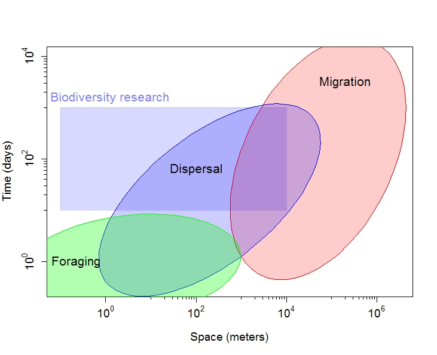
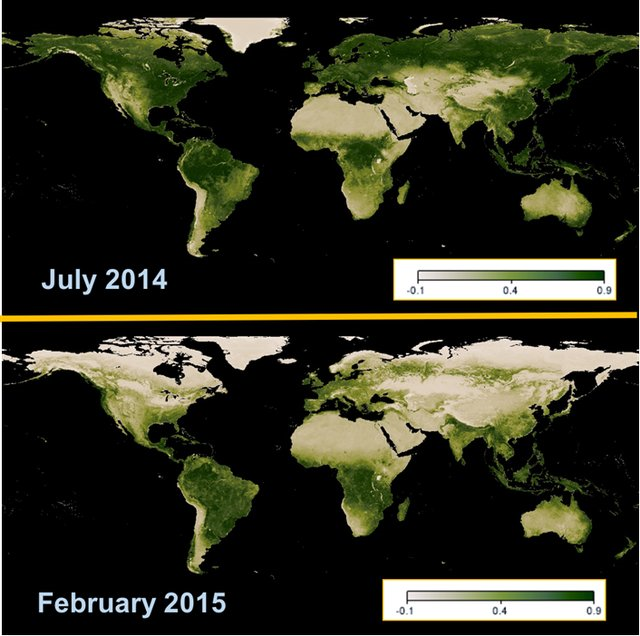

# Animal migration
## What is migration? 

Not all birds migrate and not all movements are migratory movements. The types of movements that exist range from:

1.	local movements between roosting and feeding sites, movements within the home range
2.	foraging journeys (e.g. sea birds, swifts),  
3.	dispersal: juvenile (natal) dispersal, breeding dispersal,  
4.	migration, including its most common form of seasonal migration but also nomadism and irruptive migrations.

Migrations are persistent, directional movements from one destination to another, uninterrupted by intervening resources [@dingle2014migration). The distances covered are often astounding, yet, the most ex-traordinary aspects of migration are perhaps the ubiquity of the phenomenon and the abundance of individuals involved. For instance, an estimated 1855 bird species (19% of extant species) are migrato-ry. Of the avian species that use terrestrial and freshwater habitats, roughly 45% of those breeding in North America undergo seasonal migration, and over 30% breeding in the Palearctic migrate to sub-Saharan Africa, with many more migrating within Europe. Although accurate estimates of the number of individuals involved are scant, more than 2 billion passerine birds are found to migrate to sub-Saharan Africa, whereas upwards of 3 billion insects migrate over any 1-km stretch of countryside in southern England [@Hu2016a]. Thus, migration is set apart from the other movement types by i) its timing, frequency and predictability, ii) the intensity of interactions with resident species, and iii) the spatial scales over which they connect communities and ecosystems. 


```{r ScalesMovement, out.width='120%', echo=FALSE, fig.align='center', fig.show='hold', fig.cap="\\label{fig:ScaleMove} The typical spatial and temporal scales of different movement-types. From [@Jeltsch2013]"}



```


## Why do birds migrate? 

The classic bird migration is the biannual migration between breeding and non-breeding (‘wintering’) grounds. The breeding grounds are suitable for nesting and hatchling/fledgling survival, whereas the wintering grounds are more suitable for post-fledgling and adult survival. Migration is thought to be primarily an adaptation to the seasonality of resources - to use (a surplus of) resources that are only seasonally available and to avoid shortage of resources at specific times of the year. 

Indeed, almost all places on Earth are seasonal to some degree and therefore, many migrants move between these seasonally available resources (Fig. \@ref(fig:NDVIpic)). For instance, many birds breeding in Europe migrate to the Sahel-zone in Africa in the Northern winter. The advantage of being in an area that provides better condition outweighs the cost of migration. In the temperate zones, it are usually those species that leave the breeding area during winter that have specific food requirements, which is not available dur-ing winter, e.g. insects, but abundant in the Sahel after rainfall. Many species, e.g. Red-backed shrikes (_Lanius collurio_) migrate within the non-breeding season between distinct non-breeding areas in order to make use of seasonally changing food availability [@Tøttrup2012a].  

There may be also other forms of migration or migrations as a strategy to avoid predators or pathogens. 
Other migration than seasonal migration are moult and facultative migrations. In moult migrations, birds migrate to predator-free areas where they can safely shed their flight feathers. In facultative migrations, birds only migrate long-distances when food is sparse, e.g. many finches [@newton2006advances]. At an extreme end of the spectrum are birds that are nomadic, like grey teal (_Anas gracilis_) looking for ephemeral water and food sources in a desert landscape in Australia.

Two main flight modes exist – flapping and soaring, which has consequences on when and where birds migrate: Flapping flight is energetically costly but can be used under a wide range of weather and topographic conditions, whereas for soaring thermals or wind are needed. 
The majority of birds cannot feed while flying, and in many cases the total travel distance exceeds the maximum flight distance. Thus, the birds need stop-over sites in between, where they can replenish their reserves. A good example are tundra swans (_Cygnus columbianus_) that migrate between 4000-5500 km, whereas the maximally recorded non-stop flight is 2850 km. These swans mainly refuel on energy-rich, belowground parts of macrophytes in shallow lakes and wetlands along the route.    

 

```{r NDVIpic, echo=FALSE, out.width='90%', fig.align='center', fig.show='hold', fig.cap="\\label{fig:NDVIpic}Seasonal change in global NDVI. These vegetation maps were generated from MODIS/Terra measurements of the Normalized Difference Vegetation Index (NDVI). Significant seasonal variations in the NDVI are apparent between northern hemisphere summer (July 2014; top) and winter (February 2015; bottom). Image credit: Reto Stockli, NASA Earth Observatory Group, using data from the MODIS Land Science Team (http://neo.sci.gsfc.nasa.gov)."}



```


## Terminology of specific migration patterns 

There is a variety of migration patterns of which some are also tagged with specific terms. Often it is a specific characteristic or pattern that is emphasized, e.g. the difference in distances covered led to the distinction of short- and long-distance migrants. However, the terminology is not very consistent and may be confusing at the beginning; we explain the most-frequently occurring terms below.  


## Characterisation of migration according to distances covered

**Short-distance migration** Migration over ‘shorter’ distances, typically <5000kms, e.g. from Central Europe to the Mediterranean. Sometimes, short-distance migrants are also partial migrants. Starling (_Sturnus vulgaris_)

**Long-distance migration** Migration over longer distances, usually >5000kms and often including the crossing of ecological barriers such as mountains, seas or deserts. Arctic tern (_Sterna paradisaea_), Barn Swallow (_Hirundo rustica_) 


## Characterisation of migration according to daytime of travel

**Nocturnal migration**	Most songbirds migrate at night, i.e. they are nocturnal migrants. This behavior has been attributed to reduced predation risk, good flight conditions, or for saving the daylight for feeding. Nocturnal migrants mostly fly alone or in loose flocks. Typical example: Most migratory songbirds, e.g. Wheatear (_Oenanthe oenanthe_)

**Diurnal migration**	Migratory flights take place during the day. Many larger birds are diurnal migrants, e.g. birds of prey that use thermals or swans and geese that often fly in flocks. Typical examples: raptors, bee-eaters, many geese species


## Characterisation of migration according to larger-scale patterns of migratory bouts

**Leap-frog migrations**	Populations breeding further north spend the non-breeding season further south than breeding populations from further south. Thus, some populations “overtake” others on migration.	European robin (_Erithacus rubecula_) [@KornerNievergelt.2014]

**Chain migration**	Northern breeding populations spend the non-breeding period in breeding areas of southern populations. Thus, a species can be observed year-round but it are different individuals in winter/ summer.	Cormorant (_Phalacrocorax carbo_) [@frederiksen2018wintering]


**Broad front migration**	Individuals disperse over the whole distributional range while migrating (theoretically a lot of parallel flight tracks dispersed over a large area). Yet, migrants can still accumulate depending on topography and funnel through narrow areas.	Chaffinch (_Fringilla coelebs_), many passerines: (Liechti et al. 1996)

**Funnel migration**	All individuals of a species (or population) concentrate on migration in one stop-over area or a topographically important place such as Gibraltar in Europe or the Yellow Sea in Asia.	Crane (_Grus grus_), many waders (Yellow sea!)


**Seasonal migration**

**Nomadism**	Irregular (not every year) movements to new breeding or non-breeding areas depending on food availability or other environmental conditions. Crossbill (_Loxia curvirostra_)

**Irruptive migration**	Migration of unusually many individuals of one species. Often from north to south in autumn after a good breeding season and a cold spell; usually do not occur every year but can be relatively regular and synchronized between species (Korner-Nievergelt et al. 2008). Great tit (_Parus major_), Coal tit (_Parus ater_)


**Moult migration**	Migration after the breeding season to distinct places where the birds moult before autumn migration.	Goosanders (_Mergus merganser_) (European populations moult in northern Norway)


**Partial migration**	Only a part of a population migrates while the remaining part stays resident. Which individuals stay and which migrate has often a genetic background, and in some years, the migrato-ry part enjoys a fitness benefit while in other years the resi-dents are better off.	


