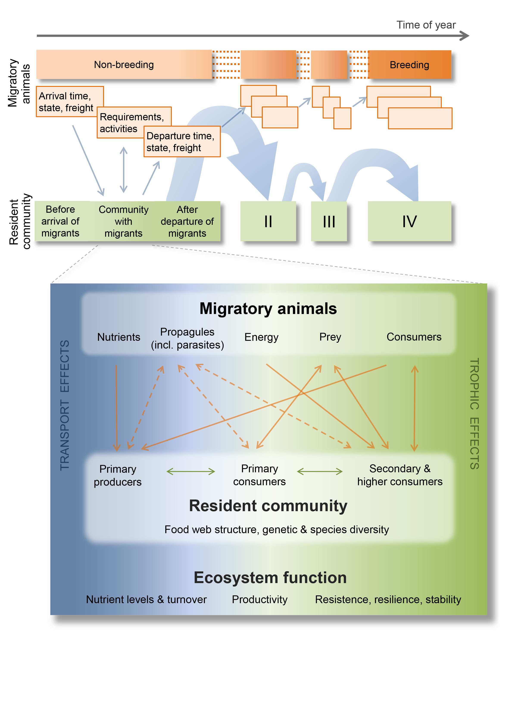
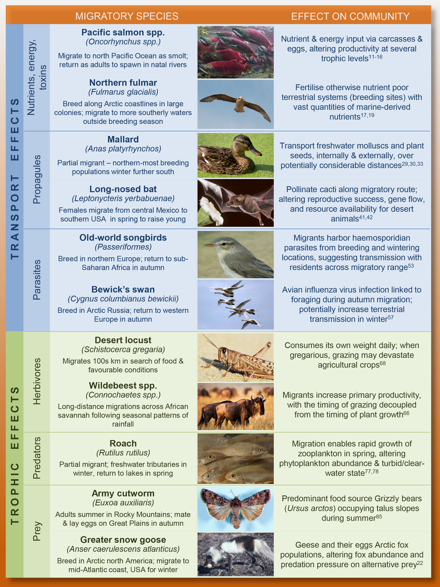

# Importance of migration for the structure and dynamics of resident communities {#Sec:Ecosystemfunctions}

## Migrants link ecological communities and ecosystem functioning worldwide

The number of migrant populations often exceeds those of resident species. For instance, we estimat-ed the number of (passerine) birds migrating between Europe and Africa to be impressive 2.1. billion individuals [@Hahn2009]! To cross the Sahara on their way to Africa, they need the energy of 34’000 tons of insects, 36’000 tons of fruit and 2’000 tons of seeds. 

If we consider migrants more generally, i.e. beyond birds, we find that migrants transport nutrients, energy, and other organisms (including seeds, mollusks, parasites, and pathogens) between disparate locations. Migrants also forage and are preyed upon throughout their journeys, thereby establishing transport and trophic interactions with resident communities. Migratory animals thus couple ecological communities across the globe and may mediate their diversity and stability. However, as yet, the influ-ence of migrants and their services on these communities is often overlooked, and as a consequence of global changes, migrations are threatened worldwide.


```{r MigLinkComm, echo=FALSE, out.width='90%', fig.align='center', fig.show='hold', fig.cap="\\label{fig:MigLinkCommunities} Schematic overview of the interactions between migrants and the multiple resident communities they visit during their annual or life-cycles. At one specific site, migrants bring with them nutrients and energy but also (propagules of) other organisms including parasites accumulated on earlier sites. The migrants’ input and state embodies carry-over effects of conditions on earlier sites which importantly determine their interactions with a resident community (orange arrows): demographic rates of resident populations (species) can be directly changed (straight arrows) as, e.g., nutrients and energy are imported, but also indirectly(dashed arrows) as the transmission of parasites and any introduced species establish competitive interactions with residents. From [@Bauer.2014]"}



```


Through these transport and trophic effects, migrants interact with resident communities. For instance, they may uniquely alter energy flow, food-web topology and stability, trophic cascades, and the struc-ture and dynamics of (meta-)communities. For example, the inputs of nutrients and energy originating from distant localities by migrants can dramatically increase resource availability, with rippling conse-quences for productivity at various trophic levels and the potential to drive the transition between alter-native stable states. Migrant-mediated transport of propagules of other organisms can lead to the es-tablishment of new or lost species, as well as influencing gene fl ow and genetic mixing among resident populations. Similarly, migrants can alter parasite transmission, diversity, and evolution by harboring a broader range of parasites than residents and by either facilitating or hindering the longdistance dis-persal of parasites. Foraging by migrants can also have profound effects on community processes and ecosystem functions. For instance, grazing by migratory animals can alter nutrient cycling, primary productivity, biomass of edible plants, competitive interactions between plant species, and ultimately, the composition and long-term persistence of the entire plant community. The most striking difference between migrant and resident consumers is, however, the pulsed nature of migrant utilization and the timing of their interactions. Together, these fundamentally defi ne the relationship between migrant abundance and primary production (in the case of migrant herbivores) or the stability of food webs (in the case of migratory predators).


```{r TransportTrophicEffects, echo=FALSE, out.width='90%', fig.align='center', fig.show='hold', fig.cap="\\label{fig:Transport&TrophicEffects} Schematic overview of the interactions between migrants and the multiple resident communities they visit during their annual or life-cycles. At one specific site, migrants bring with them nutrients and energy but also (propagules of) other organisms including parasites accumulated on earlier sites. The migrants’ input and state embodies carry-over effects of conditions on earlier sites which importantly determine their interactions with a resident community (orange arrows): demographic rates of resident populations (species) can be directly changed (straight arrows) as, e.g., nutrients and energy are imported, but also indirectly(dashed arrows) as the transmission of parasites and any introduced species establish competitive interactions with residents. From [@Bauer.2014]"}



```


The highly predictable, seasonally pulsed nature of animal migration, together with the spatial scales at which it operates and the immense number of individuals involved, not only set migration apart from other types of movement, but render it a uniquely potent, yet underappreciated, dimension of biodiversity that is intimately embedded within resident communities. Given the potential for migration to influ-ence ecological networks worldwide, we suggest integrative network approaches, through which stud-ies of community dynamics and ecosystem functioning may explicitly consider animal migrations, understand the ramifications of their declines, and assist in developing effective conservation measures.


## Animal migrations provide services and disservices

It is increasingly recognized that migrating organisms have ecological effects on resident communities and ecosystems (see above), and these can represent a multitude of services and disservices that are relevant to human infrastructure, agriculture and welfare. Services provided by migrant animals comprise economic benefits in the order of billions of dollars annually; likewise, their disservices and human-wildlife conflicts (e.g. bird-aircraft collisions) produce significant costs, both economically, and in terms of human and animal lives (Allan & Orosz 2001; Marra et al. 2009). 


Migrations involve immense numbers of individuals and constitute massive shifts of biomass that influence communities and ecosystems through the transport of nutrients, energy or other organisms, and through trophic interactions (see above). The sheer presence of migrants may raise human-wildlife conflicts; their transport and trophic effects may be essential and economically beneficial yet can also pose health risks or inflict damage. 

Examples of the multitude of highly-desirable services include Brazilian free-tailed bats (_Tadarida braziliensis_), which consume large quantities of migrant moths such as corn earworm (_Helicoverpa zea_) – one of the most important agricultural pests in North America (Boyles et al. 2011). Migratory bats have also long been acknowledged for their pollination services of, e.g. columnar cacti and agave, that play vitally important roles in the plants’ fruit production (Fleming & Valiente-Banuet 2002; Kunz et al. 2011). Similarly, migratory birds can enhance the dispersal of plant seeds or small invertebrates and thus, increase the genetic exchange between (fragmented) populations and potentially assist with ecosystem recovery (van Leeuwen et al. 2012; Viana et al. 2016). Among other ecosystem services, migratory bogong moths (_Agrotis infusa_) are an important food source for wildlife and aboriginal people in Australia (Green 2011). Although the overall economic benefit of these services is difficult to estimate, the value of, e.g., Brazilian free-tailed bats to the agricultural industry in terms of crop damage avoided and reduction in pesticide use amounts to billions of dollars per year (Boyles et al. 2011). 

In contrast to these services, migrants can also directly inflict harm or damage, either by feeding on crops or by affecting important ecosystem functions. For instance, a square km sized swarm of locusts (e.g. Schistocerca gregaria) contains about 40 million individuals that will eat the same amount of food per day as about 35,000 people [link](http://www.fao.org/ag/locusts/en/info/info/faq/). Similarly, many migratory goose populations have thrived over the past decades and their foraging is increasingly causing conflicts with agriculture and raising concern for the functioning of their Arctic breeding grounds as a global carbon sink (Van Der Wal et al. 2007). 

Another harmful effect of migrants is their role in the long-distance transport of parasites and pathogens of plants, animals, and humans (e.g. Reynolds et al. 2006; Altizer et al. 2011; Dao et al. 2014; Chapman et al. 2015): Many insects are not only agricultural pest species per se but vector a variety of plant viruses, e.g. _Rhopalosiphum padi_ aphids vector barley yellow dwarf virus. Also bats may carry agents of serious human diseases, e.g. the recent Ebola outbreak in Western Africa originated from migratory straw-colored fruit-bats (_Eidolon helvum_) (Peel et al. 2013); and finally, migratory birds have regularly been blamed for spreading pathogens such as avian influenza virus, West Nile virus or other disease vectors (e.g. Tian et al. 2015). 
The often immense numbers of migrants may create serious human-wildlife conflicts: For instance, the annual costs of bird collisions with aircraft are up to $1.2 billion worldwide (Allan & Orosz 2001) – a widely publicized example being US Airway flight 1549 which made an emergency landing on the Hudson River after colliding with a flock of geese (Marra et al. 2009). Collisions with manmade structures such as power lines, wind turbines, or towers can disrupt their normal functioning and kill large numbers of birds and bats annually, but there is great variation in estimates of costs, fatalities and their ecological significance (Cryan et al. 2014).

Thus, many stakeholders may be interested in monitoring, understanding and forecasting the large-scale movements of animal migrants, some of which are depicted in Fig. \@ref(fig:ServicesDisservices). 


```{r ServicesDisservices, echo=FALSE, out.width='90%', fig.align='center', fig.show='hold', fig.cap="\\label{fig:ServicesDisservices} A variety of stakeholders can benefit from better using the services of aerial migrants, reducing their disservices and mitigating human-wildlife conflicts – a few of which are exemplarily depicted in the outer images. From [@Bauer2017]."}

knitr::include_graphics('figures/Fig_ServicesDisservices.jpg')

```


