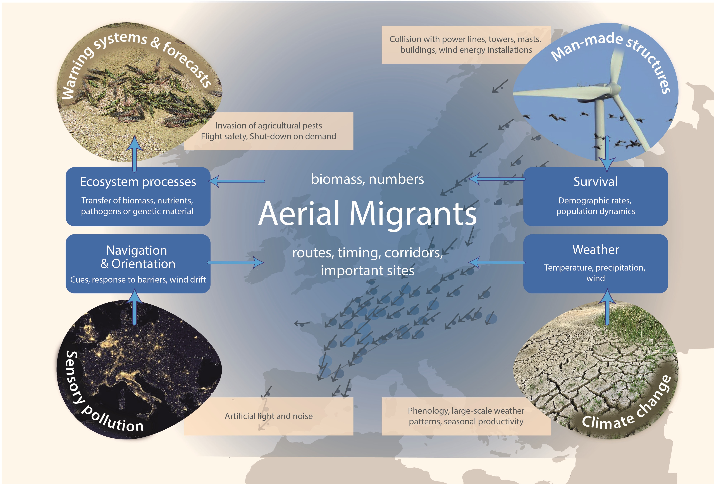

# Global change and other challenges {#Sec:GlobalChange}

## Climate change

There is good evidence that the timing of avian migrations is changing in response to climate change (e.g. James & Abbott 2014; Gilroy et al. 2016). These changes may disrupt ecosystem functions if they result in broad mismatches between migration timing and the timing of seasonal productivity (Jones and Cresswell 2010). A more complete understanding of how migrants respond to environmental change would be useful for predicting impacts of climate change on migration systems, and how these may carry over to communities and ecosystems. Many studies have documented changes in migration phenology associated with climate change (Carey 2009, La Sorte et al. 2014b), yet large gaps remain in our understanding of migration phenology and its relationship to climate (Cohen et al. 2018). 

Substantial research effort has been invested in attempts to scale-up organism-focused research approaches to answer these questions. These attempts have used numerous methods such as massive bird banding efforts, broad-scale stable isotope and genetic sampling, and individual tracking studies (Hobson and Wassenaar 2008, Thorup et al. 2014). Particularly the latter often reveal spectacular migratory behaviours (e.g. Liechti et al. 2013b). Although valuable in their own context, all of these approaches fail to sample broadly and densely enough to support coherent system-level inferences about continental-scale migration systems. 

It would be desirable to have a measure of migration phenology that enables comparisons with existing phenology network data and individual migrant tracking data. Linking phenology across levels of biological organization from individuals to ecosystems through time and space would help us understand the scaling of biological impacts of climate change (Kelly and Horton 2016). A data-science research program centred on use of the weather surveillance radar archive could provide this inference. This approach offers key advantages, such as nearly continuous, continent-scale sampling, that make it capable of addressing the challenge of advancing our understanding of migration at the system-level (Kelly and Horton 2016). Automated workflows mine NEXRAD and other data archives to produce robust metrics for quantifying migration systems, which are scalable across time and space (Van Doren and Horton 2018). A key innovation is to capture the complexity of migration systems analysis while focusing on easily interpreted and universal metrics of migration systems: migratory intensity and migratory trajectory. Most of the diverse methods employed by organismal ecologists to study migration are motivated by efforts to measure these two parameters.  Progress in this direction is occurring rapidly and it is likely that we will achieve this vision in North America by 2020.

 
## Sensory pollution 

Globally, light pollution (ALAN) has increased dramatically during the 20th century (Falchi et al. 2016) and numerous aerial migrants from diverse taxa pass through photo-polluted skies annually (La Sorte et al. 2017, Cabrera-Cruz et al. 2018). ALAN represents a powerful stimulus, which could interfere with avian sensory systems such as the magnetic and celestial compasses, that can entrain attraction to and disorientation from light or avoidance of illuminated stopover habitat across diverse spatial scales (Van Doren et al. 2017, McLaren et al. 2018). While light pollution is not novel in the environment, it is still a relatively new stimulus from an evolutionary perspective. The possibility to measure light pollution globally using remote sensing enables scientists to study its relationships to behaviour and ecology from local to macroscales. ALAN’s effects can be disruptive (e.g. Winkler et al. 2014) or even deadly (Jones and Francis 2003), ranging from significant alterations of body condition, disruptions of life histories or increased mortality through collisions with structures (e.g. Gaston et al. (2013), and may depend on proximate situations in which birds experience this. Less is known about the impact of ALAN on insect and bat migrations, but negative effects, such as reductions in moth feeding behaviours (van Langevelde et al. 2017, Grubisic et al. 2018) and bat species diversity in urban areas (Ancillotto 2015), appear likely. Future research should elucidate ALAN-effects at local to continental scales, during different phases of the annual cycle and with respect to vertical and horizontal lights, ground-based and aerial-based light, and combined effects of light intensity, spectra, location, and atmosphere. 

Similar to artificial light, anthropogenic electromagnetic noise has reached unprecedented levels. Its effects on aerial migrants are largely unclear, although it has been demonstrated that, e.g. electromagnetic noise disrupts magnetic compass orientation in caged birds under laboratory conditions (Engels et al. 2014) and new research efforts are clearly needed.

Large-scale radar studies spanning a range of urbanised and rural habitats could therefore test the ideas that anthropogenic light and electromagnetic noise represent insidious new threats to the survival of nocturnal migrants, by comparative analyses of large-scale migration patterns, individual flight behaviour and orientation performance under a range of carefully measured ALAN and electromagnetic noise levels at local to continental spatial scales and nightly to decadal temporal scales.


## Man-made structures 

Collisions with man-made structures such as power lines, wind turbines, tall towers, masts and buildings kill large numbers of birds and bats annually, although there is great variation in estimates of fatalities and their ecological significance (Cryan et al. 2014, Lambertucci et al. 2014). However, for poorly-studied species such as migratory tree bats, mortality from wind turbines in North America appears to represent a substantial population-level threat (Frick et al. 2017b) and further research is urgently needed. 

Radar-based approaches have emerged as key tools to detect, monitor and counteract these effects (May et al. 2015, Fijn et al. 2015), and have been employed particularly in wind farms. Large-scale radar mapping of migration now allows careful spatial prioritization at the planning phase of wind turbine installations. Interestingly, when investigating effects of manmade structures, portable radars can complement and extend results from larger radar networks by increasing resolution locally as has been shown in studies of foraging behaviour and fine-scale variation in habitat use by bats around wind turbines (Cryan et al. 2014). The influence of man-made structures on insect migration and flight behaviour has been considerably less explored. But like responses to natural topographic features, insects may follow man-made linear structures and can accumulate in streams of air flowing downwind from wind turbines, buildings and other tall structures. Indirect evidence for such concentrating effects at wind farms comes from the attraction of foraging insectivorous bats to these sites (Cryan et al. 2014, Foo et al. 2017). Additionally, tall buildings can influence insect flight behaviour through effects on microclimate and sunlight availability but responses of migratory insects to urbanisation may differ from those of non-migratory insects (Luder et al. 2018). 


```{r ChallengesForMig, echo=FALSE, out.width='90%', fig.align='center', fig.show='hold', fig.cap="\\label{fig:ChallengesForMig} The major challenges in migration ecology cover long-standing and novel questions. Obviously, characterizing migration routes and timing and quantifying migrant numbers is fundamental to all other questions (central area). Understanding navigation and orientation as well as the influence of weather and climate on migrants and migrations is also fundamental to understanding how migrations are shaped and which consequences these have for (the abundance of) migrant populations (blue boxes). Among the most pertinent challenges are those that highlight the direct and indirect influences of human structures and actions on migrants as well as mitigation of human-wildlife conflicts or migrant disservices. For instance, sensory pollution through artificial light and noise can impact navigation and orientation and global climate changes can change the timing of migration. From [@Bauer2019]."}



```


## Conservation of migrants and migrations 

The conservation of small, long-distance migrants such as songbirds, bats, and insects, and their migration systems, pose specific challenges (Runge et al. 2014). Migrants are dependent on multiple, potentially scattered or fragmented stopover sites (Fraser et al. 2012). Continental monitoring systems based on weather radar networks (Chilson et al. 2012b, Shamoun-Baranes et al. 2014) have emerged as one of the few techniques that can provide basic data on the use of specific habitats by large numbers of small passerine birds over very large spatial scales. For example, by examining spatial variation in dusk departure activity of nocturnal songbird migrants along the eastern seaboard of the USA (which reflects stopover decisions from the cessation of migration the previous night), Buler and Dawson (2014) demonstrated the huge importance of highly-localised floodplain hardwood forests for migratory passerines. Continuous, large-scale monitoring using weather radar also has a great potential in mapping key areas for some bat species (Chilson et al. 2012b) as well as sites and routes important for migrating moths and butterflies (Stefanescu et al. 2013, Krauel et al. 2015). Such information is invaluable for the prioritization of conservation measures in migratory systems, where actions in one location are likely to affect the situation at other locations along the route, especially across international borders (López-Hoffman et al. 2017). Establishing migratory patterns and the relative importance of paths and stopover sites emerges as more important than ever for conservation now that the connectedness of migratory populations becomes evident (Fraser et al. 2012). Migrants are likely to face difficulties adapting their migration strategies to keep up with a changing climate (Schmaljohann and Both 2017). Establishing the key stopover sites to ensure the long-term conservation of systems with migrating birds, bats, butterflies and moths is therefore a key challenge for radar aeroecology in years to come. However, securing the key sites on the ground may not be enough. The airspace connecting them is a central part of aerial migration systems and the concept of aerial protected areas, similar to marine protected areas, has recently emerged as a promising new tool to protect bird, bat and insect migration systems (Chilson et al. 2012a, Diehl 2013, Davy et al. 2017). Future efforts are therefore needed to explicitly add a vertical, airspace dimension to the conservation of long-distance migrants.


