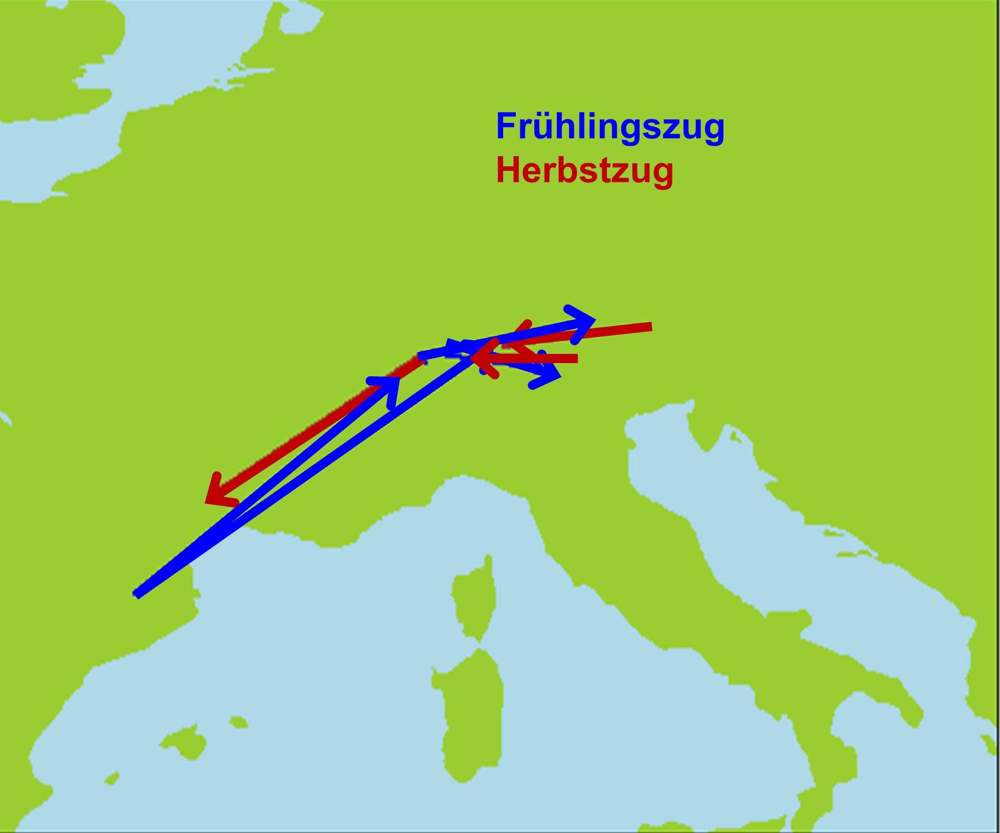

# Student projects {#Sec:StudentProjects}

We encourage students to work on a research project during the course. We have compiled a list of suggested projects (see below) but students may come up with their own suggested project within the realm of bird and migration ecology (in the latter case, please come back to us before the course). 

The projects should be pursued in groups of 2-4 students. At the end of the course (Friday), we expect an oral presentation of approx. 10 min that should cover the project's scientific background, approach, research aims, results and findings and a discussion. Ideally, the presentation is held jointly by the members of each group but if, for various reasons, this is impossible, other options can be chosen. 


## Pre-requisite: Reading and assessing scientific publications

The projects require that students get familiar with some background and/or recent developments in a specific research field. This means, students need to read and summarize a few  papers. Here are a few tips that may serve as guidelines:

1. Summarize the article 
  - Formulate the key message of the paper
  
2. Summarize the approach used
  - What is the general approach?
  - How could you characterize the model?
  - Which are the important variables and why?
  - Which scenarios were run?

3. Make your own assessment of the articles
  - Was it a convincing article? Was the approach appropriate to study the research question? Are the results supported by the data, argumentation or other information?  
  
4. Do you have questions that you would like to discuss with colleagues or experts?  


## Student project 1: Phenology - Migration timing within the season and their changes over the years

Phenology characterises the temporal course of migration. Naturally, phenology has different aspects, e.g. how individuals of a species migrate in a particular season (spread-out or synchronized), how do migration pattern vary between seasons (e.g. spring and autumn migration), how do different species vary in their timing of migration (which species migrate late, which early), how much has the timing of migration (of a specific species) changed over the years, etc.

You may use one or more of the above questions as a starting point and develop your project from them.

The following papers may be inspiring to start with:

- @Jenni.2003 


The project may include the following steps:

* Select a study species or species group  
* Characterise the migration patterns that are relevant to your question, ideally from different angles (mean migration date, variance, etc.)  
* Link the timing of migration to ecological variables, e.g. migration route, ecological characteristics of a species, etc.   
* Time permitting, link the timing of migration to environmental variables, e.g. NDVI  


**Data required and R-analyses**

Migration data "zugzeiten.txt"
- Variable baird.mean is an estimate for the average passage day corrected for truncation (migration is still ongoing at the end of the field season) 
- passage_by_spec_year.txt: Median passage day per year and species
- species_data.txt: ecological characteristica of species


You may use the following R-code to get started 

```{r StudPhenology}


```


## Student project 2: Long-term changes in morphology

Which morphological measure is relevant to migration or other life-history processes?
Wing length is obviously an important determinant of flight costs. Has wing length changed over the years in specific species? Are there patterns, e.g. in short- and long-distance migrants? How could this pattern be explained, i.e. which processes or constraints may play a role?

The following papers give some background on relevance:
- @Hahn2016 
- @Saino.2010

**Data required and R-analyses**

- Analyse species-specific ringing lists
- Select a morphological measure
- Analyse their summary statistics over the years, separately for species, sexes, etc.
	

```{r StudMorphology}


```


## Student project 3: Differential Migration

Do young and old birds or males and females migrate at different times? If such sub-groups migrate at different times in specific species, what could explain these patterns? Potential study species: age-differences in reed warblers, age- and sex-differences in chaffinches. 

Analyse species-specific ringing lists

- @LercheJrgensen.2018  
- @Briedis.2018c  


```{r StudDiffMig}


```


## Student project 4: Flight energetics in the course of a night and over the season


Dynamics of fat reserves: how do the fat reserves change over the night and over the season

comparison with expectations based on energetics and aero-physics  

	Analyse species-specific ringing lists 

specific softare:
Flight 2.4 (Windows) 
or R-package afpt


## Student project 5: Estimate survival from capture-recapture data 


Marking and recapturing individual birds allows for estimating apparent survival probability (= the probability that a bird survives and returns to the breeding site). Do survival probabilities correlate with conditions in the wintering area?

Analyse a mark-recapture data set of reed warblers from a constant ringing effort site 
using MCMC (software: Jags)


## Student project 6: Modelling spring migration: several questions

Read Chapter \@ref(Sec:MigModels) for background on state-dependent migration models, what they can do and what they can't.   

Exemplary questions that could be tackled with such a model are:

-	Long-term changes in migration phenology - which site conditions make animals change their migration timing? 
-	What are the consequences of climate-driven changes in site-conditions on timing and/or success of migration?
-	What are the consequences of human actions, e.g. hunting, on migration success?

Download the model's R-code from GitHub [link](https://github.com/slisovski/sdpMig) - you may need to install additional R-packages like devtools, Rtools, zoo, maptools.


* Run the model using the standard parameter setting.
* Change one parameter at a time and observe which output measures change
* Develop an ecological question that you would like to tackle
* Come up with a plan of how to test your own question(s)
  + which parameters would you need to change, 
  + change parameters by how much, 
  + which output measures would you look at, etc.
  
* Run the respective scenarios
* Analyse the results
* Evaluate the results


## Student project 7: Estimating Migration volume

Why would it be important to quantify the number of birds migrating? Look for possible reasons at Chapters \@ref(Sec:Ecosystemfunctions) and \@ref(Sec:GlobalChange).


-	What is the total number and biomass of birds migrating?
-	Are there changes in numbers and biomasses over the past decades?
-	What might have caused these changes and which consequences could they have?
	
Analyse overall ringing lists over the years


## Student project 8: Partial migration: Who stays in winter?

In partially migratory species, some individuals migrate while others remain as year-round residents. Partial migration is widespread among birds. Who migrates can be determined genetically, by individual charachters (sex, age, body condition), or by environmental conditions. We expect that individuals migrating benefit from a higher survival because they escape unfriendly winter conditions. On the other hand, those individuals enduring winter at the breeding site may benefit from an increased reproductive success, e.g., because they can start earlier, know the breeding sites and may occupy better breeding territories, or because they have more chances for mating.

The White-winged Snowfinch *Montifringilla nivalis nivalis* is a partial migrant living at high elevations (above the tree line) in southern European mountain areas. In other subspecies, the species occurs in mountain areas from Turkey eastward until the Himalaya. The Snowfinch is highly adapted to living at high-elevation harsh climate. In Switzerland, it can be observed during winter at feeders in ski areas or mountain huts. Its migration behaviour is still largely unknown. In the Pyrenees and in southern France, wintering indivividuals can be regularly observed, ocassionally in large numbers. Ring recoveries also indicate seasonal migration (Fig. \@ref(fig:migsnowfinch)). 

```{r migsnowfinch, echo=FALSE, fig.cap="Seasonal migration of Snowfinches as observed by ring recoveries. Arrows connect the ringing location with the recovery location. Blue = ringed during winter and recovered during summer (spring migration). Red = ringed during summer and recovered during winter (autumn migration)." }
library(knitr)


```


The following papers introduce the topic of partial and/or differential migration.

- @Zuniga.2017    
- @Kokko.2006  
- @Albouy.2018 (in French)    

The project aim is to describe who is migrating in the Snowfinch population of the Swiss Alps and to discuss possible causes of different migration behaviour between age and sex classes.

Use a mark-resighting data set of Snowfinches from the Swiss Alps to describe which individuals spend the winter in the breeding areas (Swiss Alps). The example data contain capturing and resighting dates for individuals with known age and sex.

The age is coded as 1 = nestling, 3 = first calendar year, 4 = not first calendar year, 5 = second calendar year, 6 = older than second calendar year.

The below R-code can be used to start with. It extracts the number of individuals (number of different ring numbers) seen for each month. The observation effort differed over time but we can assume that it was the same for all age and sex classes.

```{r resight, fig.cap="Number of individuals observed per month for each age and sex class"}
load("data/Snowfinch_resightings.rda")
aggdat <- aggregate(ringnr~month+sex+age, data=dat, function(x) nlevels(factor(x)))
aggdat <- aggdat[aggdat$age>3,] # only include individuals from their first winter onward (delete nestlings and first calendar-year birds)

# include months with no individuals observed
datcomplete <- expand.grid(month=1:11, sex=c("f", "m"), age=c(4,5,6))
rowid <- paste(datcomplete$month, datcomplete$sex, datcomplete$age)
rowidaggdat <- paste(aggdat$month, aggdat$sex, aggdat$age)
datcomplete$n <- aggdat$ringnr[match(rowid, rowidaggdat)]
datcomplete$n[is.na(datcomplete$n)] <- 0

plot(datcomplete$month, datcomplete$n,
     las=1, ylab="Number of individuals observed", xlab="Month")
# first year males
index <- datcomplete$age==5&datcomplete$sex=="m"
lines(datcomplete$month[index], datcomplete$n[index], lwd=2, col="lightblue")

# second year and older males
index <- datcomplete$age==6&datcomplete$sex=="m"
lines(datcomplete$month[index], datcomplete$n[index], lwd=2, 
      col="blue")

# males, age not identified
index <- datcomplete$age==4&datcomplete$sex=="m"
lines(datcomplete$month[index], datcomplete$n[index], lwd=2, 
      col="blue", lty=3)


# first year females
index <- datcomplete$age==5&datcomplete$sex=="f"
lines(datcomplete$month[index], datcomplete$n[index], lwd=2, 
      col="orange")


# second year and older females
index <- datcomplete$age==6&datcomplete$sex=="f"
lines(datcomplete$month[index], datcomplete$n[index], lwd=2, 
      col="brown")

# females, age not identified
index <- datcomplete$age==4&datcomplete$sex=="f"
lines(datcomplete$month[index], datcomplete$n[index], lwd=2, 
      col="brown", lty=3)

legend(5, 40, lwd=2, lty=c(1,3,1,1,3,1), col=c("brown", "brown", "orange", "blue", "blue", "lightblue"), legend=c("females age 2y+", "females age unknown", "females 1y", "males age 2y+", "males age unknown", "males 1y"))

```

Discuss possible proximate and ultimate causes for the different seasonal distribution of the sexes and age classes. 


## Student project 9: Geolocation - tracking small birds

Where and when birds migrate is typically investigated with individual tracking methods \@ref(Sec:FieldMethods). Among the various devices that exist to date, geolocators have been particularly useful for small (light-weight) birds. However, to get from the light patterns they record to positions requires advanced methods. A manual has been produced that details the necessary steps, the potential pitfalls and their solutions  [link](https://geolocationmanual.vogelwarte.ch/GeoLight.html).

In this project, student apply existing analytical methods to individual geolocator data from selected species and:

- Analyse light patterns from geolocator recordings
- Translate a time series of light levels into geographical locations and present them on maps
- Derive the schedule of movements throughout the year


