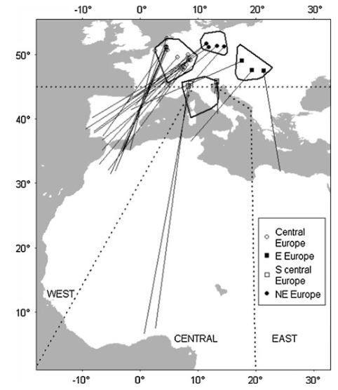

# Exercise: Estimating migratory connectivity {#migcon}

## Background

Migratory connectivity has been defined as the extent to which different areas are connected over seasons by migrating animals [@Webster.2002]. A possibility to quantify migratory connectivity is the estimation of the proportion of individuals that migrate from specific breeding areas to specific non-breeding areas, e.g. in @saunders_multispecies_2025, @vonRonnJanAC2020.

In order to estimate migratory connectivity it is required that we know of a large number of individuals from different breeding populations where they spend the non-breeding season. Often, it is not possible to track that many individuals from different populations. However, marking individuals such as ringing birds is done on a large scale by voluntary bird ringers and resightings or recoveries of such marked birds during the non-breeding season yields information on the connection of a breeding with a non-breeding areas by those birds that were resighted or recovered. The difficulty is that the probability of reencountering (resighting or recovering) a ringed bird very likely differs between different non-breeding area. Ring recovery probability depends primarily on human density and activity and also on the bird's behaviour. As a consequence, the proportions of ring reecounters in the different non-breeding areas does not reflect the proportions of birds migrating to the different non-breeding areas in an unbiased way. However, when there are at least as many breeding areas as there are non-breeding areas considered in a study, the unbiased proportion of birds migrating to the different non-breeding areas becomes estimable. That is because, for example with two breeding areas (1 and 2) and two non-breeding areas (A and B), the following equations can be written:  

$N_1 = \frac{R_{1A}}{r_A} + \frac{R_{1B}}{r_B}$  
$N_2 = \frac{R_{2A}}{r_A} + \frac{R_{2B}}{r_B}$  

where $N_1$ and $N_2$ are the number of ringed birds in the breeding areas 1 and 2, $R_{1A}$, $R_{2A}$, $R_{1B}$ and $R_{2B}$ are the number of reencountered indidivuals from the two breeding areas in the two non-breeding areas, and $r_A$ and $r_B$ are the reencounter probabilities in the two non-breeding areas. Given the number of ringed individuals and the number of reencountered individuals are known, these equation system has two unknown parameters, $r_A$ and $r_B$ and can be solved. Knowing the reencounter probabilities, the proportions of birds that migrated from each breeding area to each non-breeding area can be calculated.

Alternatively, we can model the number of reencounters from breeding area $i$ using a multinomial model:  
$(R_{iA}, R_{iB}, N_i -R_{iA} -R_{iB}) \sim multinomial((m_{iA}r_A, m_{iB}r_B),  1-m_{iA}r_A-m_{iB}r_B)), N_i)$, where $m_{iA}$ and $m_{iB}$  are the proportions of birds migrating from breeding area $i$ to the non-breeding areas $A$ and $B$. The model parameters are estimable when the number of breeding area is at least as high as the number of non-breeding areas. 


## Nightingale example

The EURING data base contains 16 reencounters of Common Nightingale *Luscinia megarhynchos* in western Africa from birds ringed in W central Europe, 5 in western Africa from birds ringed in NE central Europe, 4 in central Africa from birds ringed in S central Europe and 1 each in western central and eastern Africa from birds ringed in E Europe (\@ref(fig:migconnightingale)).


```{r migconnightingale, echo=FALSE, out.width='90%', fig.align='center', fig.show='hold', fig.cap="Ring recovery data of the Common nightingale. Lines connect the ringing location with the recovery location. Polygons indicate different breeding areas."}



```


Estimate the proportion of birds from each of the 4 breeding areas migrating to each of the 3 non-breeding areas within Africa.  

A solution using Stan(https://mc-stan.org/) is given in the next R-junk (there are many other ways to solve the problem, feel free to use another method you are more familiar with. Or skip the estimation part and go directly to the questions below.) 

```{r, eval=FALSE}
# data
Nringed <- c(1035, 1220, 4633, 1448) # total number of ringed birds in W central Europe, S central Europe, NE central Europe and E Europe
recmatrix <- matrix(c(16, 0, 0,  
                      0, 4, 0,
                      5, 0, 0,
                      1, 1, 1), nrow=4, ncol=3, byrow=TRUE)

# compile data for Stan (you may need to install Stan before being able to run the next code)
# 
y <- cbind(recmatrix, Nringed-apply(recmatrix, 1, sum))

datax <- list(y=y,
              ngroups=nrow(y),
              ndestinations=ncol(recmatrix))

# 
# you may need to install rstan:
# make sure you  have RTools installed https://cran.r-project.org/bin/windows/Rtools/
# then use 
# #Optional: clean up old versions
# remove.packages(c("rstan", "StanHeaders"))
# #Install RStan from CRAN
#install.packages("rstan", dependencies = TRUE)

library(rstan)  
mod <- stan(file="stan/multinom_migcon.stan", data=datax, pars=c("m", "r"))
bsim <- as.data.frame(mod)


# estimated recovery probabilities in western , central and eastern Africa
apply(bsim[,c("r[1]","r[2]","r[3]")], 2, quantile, probs=c(0.5, 0.025, 0.975))

# estimated proportion of birds from W EU migrating to western, central and eastern Africa 
apply(bsim[,c("m[1,1]","m[1,2]","m[1,3]")], 2, quantile, probs=c(0.5, 0.025, 0.975))


# estimated proportion of birds from S EU migrating to western, central and eastern Africa 
apply(bsim[,c("m[2,1]","m[2,2]","m[2,3]")], 2, quantile, probs=c(0.5, 0.025, 0.975))


# estimated proportion of birds from NE EU migrating to western, central and eastern Africa 
apply(bsim[,c("m[3,1]","m[3,2]","m[3,3]")], 2, quantile, probs=c(0.5, 0.025, 0.975))

# estimated proportion of birds from E EU migrating to western, central and eastern Africa 
apply(bsim[,c("m[4,1]","m[4,2]","m[4,3]")], 2, quantile, probs=c(0.5, 0.025, 0.975))

```


You find the results also in @korner-nievergelt_migratory_2012.   

Questions:  
What crucial assumptions are made in this analysis?  
When may these assumptions be violated? What couuld be done to better meet the assumptions?  
What do you think about the strength of migratory connectivity in the nightingale?   
Is it strong or week? What are implications of that migratory connectivity concerning population dynamics or threats of the species?
